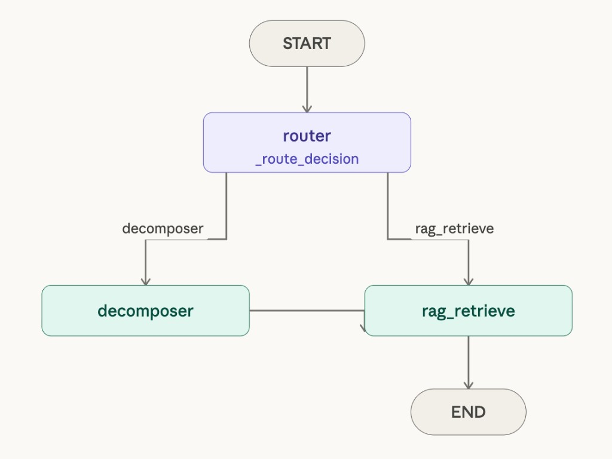

# Agentic RAG DocQuery

A production-grade, agentic Retrieval-Augmented Generation (RAG) system for
intelligent document querying. Upload documents in multiple formats, ask complex
questions, and receive grounded, cited answers powered by a multi-hop reasoning
agent and your choice of LLM provider.

---

## Table of Contents

- [Overview](#overview)
- [Features](#features)
- [Architecture](#architecture)
- [Tech Stack](#tech-stack)
- [Why This Stack](#why-this-stack)
- [Tradeoffs](#tradeoffs) 
- [Project Structure](#project-structure)
- [Getting Started](#getting-started)
- [API Reference](#api-reference)
- [Deployment](#deployment)
- [What We Would Do Differently at Scale](#what-we-would-do-differently-at-scale)

---

## Overview

Agentic RAG DocQuery is a full-stack document intelligence platform. It indexes
documents into a vector database, then uses a stateful reasoning agent to answer
questions by retrieving and synthesizing relevant content. Unlike simple chatbot
wrappers, every answer is traceable to a specific source chunk, page, and
document.

The system is built for extensibility: swap LLM providers mid-session, upload
documents in multiple formats, and inspect the full reasoning chain the agent
used to arrive at an answer.

---

## Features 

- Multi-format document ingestion: PDF, DOCX, Markdown, plain text, and web URLs
- Semantic search using sentence-transformers embeddings stored in Qdrant
- Agentic multi-hop reasoning: LangGraph state machine decomposes complex
  questions into sub-questions and retrieves independently for each
- Real-time token streaming via Server-Sent Events (SSE)
- Source citations with inline references tied to specific chunks and pages
- Hop trace: collapsible reasoning chain UI showing sub-questions asked and
  chunks retrieved at each step
- Switchable LLM providers: Groq (Llama 3.3), Google Gemini (2.0 Flash),
  Mistral (Large)
- Multi-turn conversation memory backed by SQLite
- Dedicated document summarization and cross-document comparison endpoints
- Auto-generated Swagger UI at /docs
- Docker Compose for local development; Google Cloud Run for production
- GitHub Actions CI/CD: test, build, push to GCR, deploy to Cloud Run

---

## Architecture

### System Overview

```
User (Browser)
      |
      |  HTTP / SSE
      v
Next.js Frontend  (port 3000)
      |
      |  REST API
      v
FastAPI Backend  (port 8000)
      |
      +-------> Document Ingestion Pipeline
      |              LlamaIndex Loaders (PDF / DOCX / MD / TXT / URL)
      |              Sentence Splitter  (512 tokens, 50-token overlap)
      |              sentence-transformers Embeddings
      |              Qdrant Vector Store  (port 6333)
      |
      +-------> LangGraph Agent
                     Query Router (simple vs complex)
                     Sub-question Decomposer
                     RAG Retrieval Tool  ->  Qdrant
                     Synthesizer (LLM + citations)
                     Summarization Tool
                     Comparison Tool
                          |
                          v
                     LLM Provider
                     (Groq / Gemini / Mistral)
```

### LangGraph Agent Flow



The router classifies the question as simple or complex using a small fast model.
Complex questions go through the decomposer which breaks them into 2-4
sub-questions — each retrieved independently from Qdrant and deduplicated.
The retrieved chunks are passed back to `query.py` where the synthesizer streams
the final answer with inline citations. Synthesis happens outside the graph to
preserve SSE token streaming.

```
START → [router] → simple  → [rag_retrieve] → END → stream answer
                 → complex → [decomposer] → [rag_retrieve] → END → stream answer
```

### CI/CD Pipeline

```
Push to main
      |
      v
GitHub Actions
      |
      +---> Run tests        (pytest + ESLint)
      +---> Build images     (backend + frontend Docker)
      +---> Push to registry (Google Container Registry)
      +---> Deploy           (Google Cloud Run)
```

---

## Tech Stack

| Layer               | Technology                        | Purpose                                      |
|---------------------|-----------------------------------|----------------------------------------------|
| Backend             | FastAPI, Python 3.11+             | REST API, SSE streaming, Swagger UI          |
| Frontend            | Next.js 14, TypeScript, Tailwind  | UI, real-time streaming, component library   |
| Document Ingestion  | LlamaIndex                        | Loaders, chunking, metadata extraction       |
| RAG Pipeline        | LangChain                         | Retrieval chain, prompt templates, LLM layer |
| Agent Orchestration | LangGraph                         | Stateful multi-hop reasoning loop            |
| Vector Store        | Qdrant                            | Semantic search, metadata filtering          |
| Embeddings          | sentence-transformers (MiniLM-L6) | Local, free, CPU-compatible                  |
| LLM Providers       | Groq, Google Gemini, Mistral      | Answer generation, switchable per session    |
| Memory              | SQLite + ConversationBufferMemory | Persistent multi-turn sessions               |
| Containerization    | Docker, Docker Compose            | Local development environment                |
| Registry            | Google Container Registry         | Docker image storage                         |
| Deployment          | Google Cloud Run                  | Serverless container hosting                 |
| CI/CD               | GitHub Actions                    | Automated test, build, deploy pipeline       |

---

## Why This Stack

### LlamaIndex for ingestion, LangChain for the pipeline

LlamaIndex has first-class support for document loaders, node parsers, and
metadata-aware chunking. It handles PDF page numbers, heading extraction, and
URL scraping more cleanly than LangChain document loaders. LangChain is used
downstream where its prompt template system and provider interfaces are stronger.

### LangGraph for agent orchestration

LangGraph models the agent as an explicit state machine with typed state,
conditional edges, and named nodes. This is preferable to LangChain AgentExecutor
because the routing logic is a first-class conditional edge rather than an
LLM-decided tool call loop, each node is a testable pure function, and hop_trace
events are produced naturally by emitting state at each node transition.

### Qdrant over FAISS or Pinecone

FAISS is in-memory with no persistence or metadata filtering. Pinecone introduces
vendor lock-in and cost at scale. Qdrant runs locally via Docker with full
persistence, supports rich payload filtering, and has a managed cloud tier that
requires no client code changes when moving to production.

### sentence-transformers over OpenAI embeddings

all-MiniLM-L6-v2 runs entirely locally with no API calls, no cost per embedding,
and no rate limits. This keeps the ingestion pipeline fully offline-capable.
Swapping to text-embedding-3-small from OpenAI if higher retrieval quality is
needed is a one-line change.

### Groq, Gemini, and Mistral over OpenAI-only

Provider diversity avoids single-vendor dependency and surfaces real tradeoffs:

- Groq: lowest latency, generous free tier, best for real-time streaming
- Gemini 2.0 Flash: largest context window, strong on long-document tasks
- Mistral Large: strong instruction following, EU data residency option

### Google Cloud Run over Kubernetes or a VPS

Cloud Run is serverless: it scales to zero with no idle cost, handles container
deployment without cluster management, and integrates natively with GCR and
Cloud IAM. For this project size it is operationally simpler than Kubernetes and
more cost-predictable than a fixed VPS.

---

## Tradeoffs

### Chunking strategy

Fixed-size chunking with sentence splitting works well for general prose but does
not respect document structure such as headings, tables, or code blocks. A
production upgrade would use hierarchical chunking or document-specific parsers
that preserve semantic boundaries.

### Self-hosted Qdrant

Qdrant runs in Docker locally and as a Cloud Run service in production. This is
not horizontally scalable without additional configuration. For high write
throughput, Qdrant Cloud or a dedicated VM would be more appropriate.

### SQLite for session memory

SQLite is file-based and inconsistent across multiple Cloud Run instances. A
production fix replaces SQLite with Redis or a managed database.

### No reranking

Retrieved chunks are ranked purely by vector similarity. Adding a cross-encoder
reranker as a post-retrieval step would improve answer quality for complex
queries at the cost of additional latency.

### No authentication

The API has no authentication layer. A production deployment serving multiple
users requires API key validation or an OAuth integration.

### Agent model tiering

The router node (simple vs complex classification) uses `llama-3.1-8b-instant`
while the decomposer and synthesizer use `llama-3.3-70b-versatile`. Routing is
a binary classification over a single sentence — a small model handles it with
the same accuracy as a large one at a fraction of the token cost and latency.
The decomposer and synthesizer use the full model because decomposition quality
directly determines retrieval quality, and synthesis requires multi-document
reasoning with accurate citation placement.

The tradeoff is a small increase in code complexity (`small_model` parameter
in `llm_factory.py`). At scale, the router call fires on every single request,
so keeping it cheap and fast compounds meaningfully.

### LLM model selection per provider

The specific models chosen for each provider reflect free-tier availability and
speed/quality balance:

- **Groq routing**: `llama-3.1-8b-instant` - binary classification needs almost
  no reasoning capacity; the 8B model is sufficient and responds near-instantly.
- **Groq synthesis/decomposition**: `llama-3.3-70b-versatile` - used where
  quality matters: writing precise sub-questions and synthesizing multi-source
  answers with accurate citations.
- **Gemini routing + synthesis**: both use `gemini-2.0-flash` - Flash is already
  Google's speed/cost-optimised tier. `gemini-1.5-pro` is paid-only as of 2026.
- **Mistral routing**: `mistral-small-latest` - adequate for classification,
  significantly cheaper than Large.
- **Mistral synthesis/decomposition**: `mistral-large-latest` - strong
  instruction following for decomposition and citation-aware synthesis.

---

## Project Structure

```
agentic-rag-docquery/
├── backend/
│   ├── app/
│   │   ├── main.py                   # FastAPI app, CORS, routers
│   │   ├── api/
│   │   │   ├── documents.py          # POST /upload, GET /documents, DELETE
│   │   │   ├── query.py              # POST /query, /summarize, /compare
│   │   │   └── provider.py           # POST /switch-provider, GET /health
│   │   ├── core/
│   │   │   ├── config.py             # Pydantic Settings
│   │   │   └── llm_factory.py        # Groq / Gemini / Mistral factory
│   │   ├── ingestion/
│   │   │   ├── loader.py             # LlamaIndex document loaders
│   │   │   ├── chunker.py            # SentenceSplitter
│   │   │   └── indexer.py            # Qdrant upsert
│   │   ├── retrieval/
│   │   │   └── retriever.py          # LangChain Qdrant retriever
│   │   ├── agent/
│   │   │   ├── graph.py              # LangGraph StateGraph
│   │   │   ├── nodes.py              # router_node, decomposer_node, rag_retrieve_node
│   │   │   ├── tools.py              # RAG, summarize, compare tools
│   │   │   ├── memory.py             # SQLite session memory
│   │   │   └── prompts.py            # prompt templates
│   │   └── schemas.py                # Pydantic models
│   ├── Dockerfile
│   ├── requirements.txt
│   └── .env.example
├── frontend/
│   ├── src/
│   │   ├── app/
│   │   │   ├── page.tsx
│   │   │   └── layout.tsx
│   │   └── components/
│   │       ├── ChatInterface.tsx
│   │       ├── MessageBubble.tsx
│   │       ├── SourceCitation.tsx
│   │       ├── HopTrace.tsx
│   │       ├── FileUpload.tsx
│   │       ├── DocumentList.tsx
│   │       └── ProviderSelector.tsx
│   ├── Dockerfile
│   ├── package.json
│   └── .env.local.example
├── .github/
│   └── workflows/
│       └── deploy.yml
├── docs/
│   └── langgraph-flow.png            # LangGraph agent flow diagram
├── docker-compose.yml
└── README.md
```

---

## Getting Started

### Prerequisites

- Docker and Docker Compose
- Node.js 20+
- Python 3.11+
- API keys for Groq, Google AI Studio (Gemini), and Mistral

### Local Development

1. Clone the repository:

   ```bash
   git clone https://github.com/laharigandrapu11/agentic-rag-docquery.git
   cd agentic-rag-docquery
   ```

2. Copy environment variable templates and fill in API keys:

   ```bash
   cp backend/.env.example backend/.env
   touch frontend/.env.local
   ```

   Open `backend/.env` and fill in your API keys for Groq, Gemini, and Mistral.

3. Start all services:

   ```bash
   docker-compose up --build
   ```

4. Open the application:

   - Frontend:       http://localhost:3000
   - Backend API:    http://localhost:8000
   - Swagger UI:     http://localhost:8000/docs
   - Qdrant:         http://localhost:6333/dashboard

---

## API Reference

| Method | Endpoint                  | Description                                              |
|--------|---------------------------|----------------------------------------------------------|
| GET    | /health                   | Service health check                                     |
| POST   | /api/upload               | Upload a file (multipart) or submit a URL for indexing   |
| GET    | /api/documents            | List all indexed documents                               |
| DELETE | /api/documents/{doc_id}   | Remove a document and all its vectors from Qdrant        |
| POST   | /api/query                | Ask a question; SSE stream of token and hop_trace events |
| POST   | /api/summarize            | Summarize a specific document                            |
| POST   | /api/compare              | Compare content across multiple indexed documents        |
| POST   | /api/switch-provider      | Set the active LLM provider for the current session      |

Full interactive documentation is available at /docs.

---

## Deployment

The project deploys automatically to Google Cloud Run on every push to main.

### Prerequisites

1. **Google Cloud Project**
   - Create a project at https://console.cloud.google.com
   - Enable the following APIs:
     - Cloud Run API
     - Container Registry API
     - Cloud Build API
   - Note your project ID

2. **Service Account**
   - Go to IAM & Admin → Service Accounts
   - Create a new service account with these roles:
     - Cloud Run Admin
     - Storage Admin (for GCR)
   - Generate a JSON key and save it securely

3. **Qdrant Cloud**
   - Sign up at https://cloud.qdrant.io
   - Create a free cluster (0.5GB, sufficient for testing)
   - Copy the cluster URL (e.g., `https://xyz.qdrant.io:6333`)
   - Copy the API key from the cluster dashboard

### Required GitHub Secrets

Go to your repository → Settings → Secrets and variables → Actions, and add:

| Secret Name       | Value                                                      |
|-------------------|------------------------------------------------------------|
| GCP_PROJECT_ID    | Your Google Cloud project ID                               |
| GCP_SA_KEY        | Full JSON content of the service account key               |
| GROQ_API_KEY      | API key from https://console.groq.com                      |
| GOOGLE_API_KEY    | API key from https://aistudio.google.com/app/apikey        |
| MISTRAL_API_KEY   | API key from https://console.mistral.ai                    |
| QDRANT_URL        | Qdrant Cloud cluster URL (e.g., `https://xyz.qdrant.io:6333`) |
| QDRANT_API_KEY    | Qdrant Cloud API key                                       |
| BACKEND_URL       | Set this AFTER the first deploy (see below)                |

### Deployment Steps

1. Push to `main` to trigger the workflow:
   ```bash
   git push origin main
   ```

2. Monitor the deploy at Actions → Deploy

3. After the first successful deploy:
   - Go to Cloud Run console
   - Find the `rag-backend` service
   - Copy the service URL (e.g., `https://rag-backend-xyz.a.run.app`)
   - Add it as the `BACKEND_URL` secret in GitHub
   - Push again to redeploy the frontend with the correct backend URL

4. Access your live app at the `rag-frontend` Cloud Run service URL

### Pipeline Steps

1. Run backend tests with pytest
2. Run frontend lint with ESLint
3. Build Docker images for backend and frontend
4. Push images to Google Container Registry
5. Deploy backend service to Cloud Run
6. Deploy frontend service to Cloud Run

---

## What We Would Do Differently at Scale

- **Reranking**: Add a cross-encoder reranker between retrieval and synthesis
  to improve answer quality on complex multi-document queries.
- **Hierarchical chunking**: Replace fixed-size chunking with structure-aware
  parsers that respect headings, tables, and code blocks.
- **Managed vector store**: Migrate from self-hosted Qdrant to Qdrant Cloud for
  horizontal scalability and managed backups.
- **Redis for memory**: Replace SQLite with Redis to support multi-instance
  Cloud Run deployments without session inconsistency.
- **Authentication**: Add API key validation or OAuth before exposing the API
  to multiple users.
- **Evaluation pipeline**: Integrate RAGAS to measure retrieval precision,
  answer faithfulness, and citation accuracy against a golden dataset.
- **Observability**: Add LangSmith or LangFuse tracing to monitor agent
  execution, per-node latency, and token usage in production.
